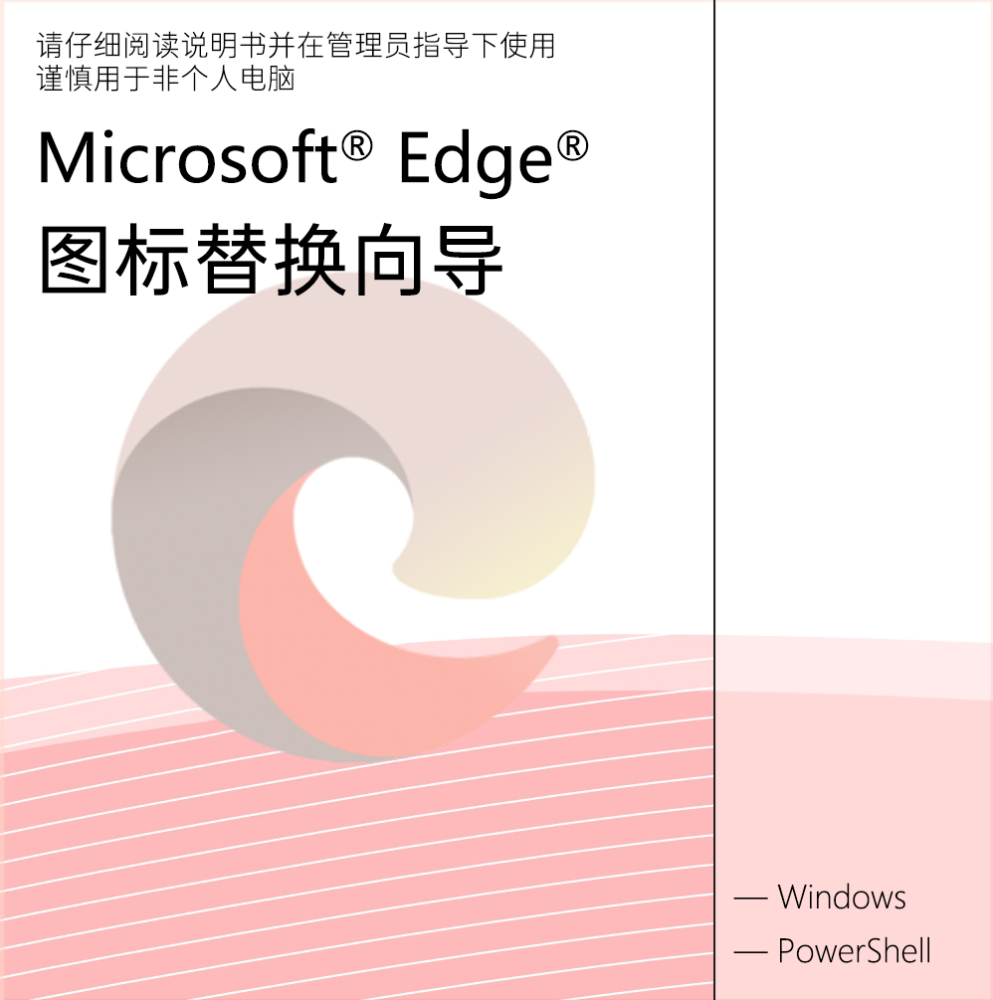

# 绪山真寻.exe

把 Windows 电脑上 Microsoft Edge 的图标一键替换成绪山真寻的粉色呆毛。
**桌面快捷方式和运行时任务栏图标都会变**，重启电脑后依然生效。

提供两种呆毛角度任选：**原版角度**（`oyama-mahiro-ahoge.ico`，角度与原版 Edge 图标一致）
与**呆毛角度**（`oyama-mahiro-ahoge-rotated.ico`，角度更符合呆毛特征）。

## 使用方式

**方式一：图形界面（推荐）**

1. 双击 `绪山真寻.exe`。
2. 在「用户账户控制（UAC）」弹窗中选择「是」。
3. 等待图形界面出现，在两张预览卡片里选好图标变体。
4. 再点「安装呆毛图标」即可。

恢复原版图标方式：点击「恢复原版图标」按钮。

**方式二：命令行**

1. 右键 `Install.cmd` 以管理员身份运行。
2. 程序会交互式询问选择哪个图标变体。
3. 程序会自动关闭 Edge、替换图标、注册自愈任务、刷新图标缓存。
4. 完成。打开 Edge 验证，任务栏图标也是粉色呆毛。

恢复原版图标方式：右键 `Uninstall.cmd` 以管理员身份运行。

## 借物表

- `oyama-mahiro-ahoge.ico` 和 `oyama-mahiro-ahoge-rotated.ico` 来自[ B 站](https://www.bilibili.com/video/BV1nv4y1L7qZ?comment_on=1&comment_root_id=157085421088&share_tag=s_i#reply157085421088)。
- `start-screen.png` 修改自 [moesoha/debian-media-box: “Debian 小药盒”，一个用来包装 Debian 安装介质的盒子设计和介绍用的说明书](https://github.com/moesoha/debian-media-box/tree/master)。